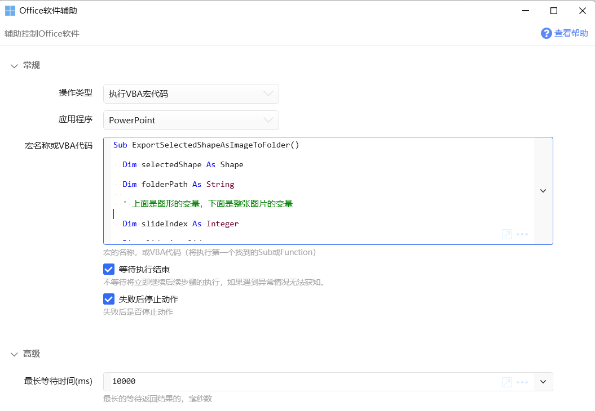
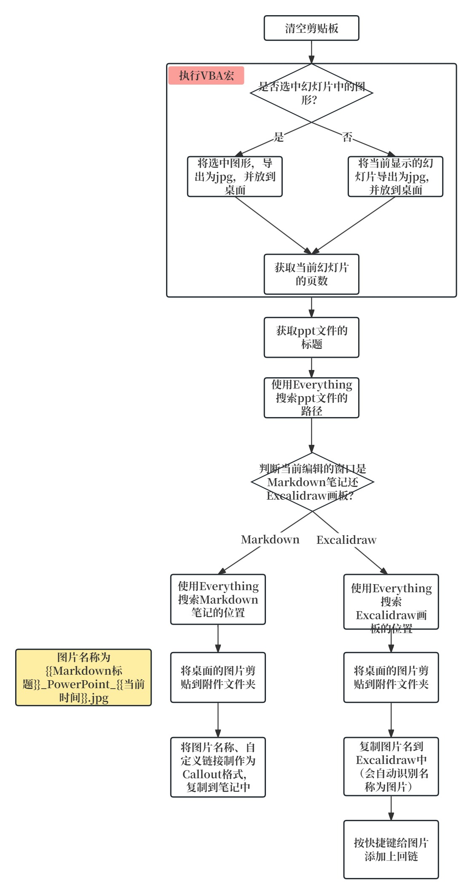

# PowerPoint-Obsidian

用Quicker可以帮助我们完成一些繁琐的、需要多个操作步骤的动作。

这篇文章中，我用Quicker将的PowerPoint导出的图片复制到到Obsidian文件夹、并制作回链且按照callout格式复制到Obsidian笔记中，使之点击Obsidian中的链接能自动打开ppt文件，并跳转到ppt的指定页数。

之前的BookxNote、Zotero、Eagle，它们三者的共同点是，在软件安装时，就已经在注册表中注册了相关的回链协议。

例如当链接为`eagle://`、`eagle://item/LUJ9441DVAFRL`，系统能识别并自动打开Eagle软件。前者代表只打开Eagle软件，后者带item参数，能打开Eagle软件同时跳转到对应的图片位置。BookxNote和Zotero同理。

上一篇文章介绍了PotPlayer怎么注册回链协议，这篇文章介绍一下PowerPoint的回链协议。

前几天，我在刷B站视频时，看到了大佬一鸣惊人_001的视频：[摘录视频、PDF、PPT到Obsidian和Excalidraw的配置教程 -- 一键摘录内容，点击回链跳回原文\_哔哩哔哩\_bilibili](https://www.bilibili.com/video/BV1qH4y1j7Q6/?spm_id_from=333.999.0.0)，里面详细介绍了生成摘录信息、处理摘录信息、响应回链三个部分。由于生成摘录信息和处理摘录信息我用Quicker替代了，因此大家只需要下载响应回链部分就可。这是大佬的github仓库地址[GitHub - Bowen-0x00/CustomProtocolHandler: CustomProtocolHandler是一个用于处理自定义协议的工具，旨在实现处理自定义协议链接回链。方便通过笔记软件进行知识管理。如点击自定义协议链接时能够跳回原位，包括但不限于视频、PPT和PDF。](https://github.com/Bowen-0x00/CustomProtocolHandler/releases)

大家下载好后不需要像PotPlayer一样修改程序的路径，因为PowerPoint在电脑中的安装位置是固定的，所以程序能自动找到。

右键以管理员身份运行“设置注册表.bat”，在电脑的注册表里添加自动以回链协议。在运行前，把这几个文件放在一个固定位置，移动过的话需要重新以管理员身份运行一下（我是小白，也不太清楚，一般不会出问题）。

PowerPoint的回链：`ymjr://open?app=PPT&file=文件路径&page=当前幻灯片页数`，点击后就能打开PowerPoint、并且打开ppt文件、并且跳到对应的页数，如果上一步响应回链部分配置没问题的话。而且如果**源ppt文件的路径**移动过的话，是无法打开该ppt文件的的。

该Quicker动作中，将ppt中的图片或幻灯片导出为jpg图片我用的是VBA宏。

该宏有两个作用：

1. 自动判断当前有没有选中ppt中的图片，如果选中，则将图形导出为jpg，并放到桌面；如果没选中任何图形，则将当前显示的幻灯片导出为jpg并放到桌面。

（也可以导出为png，只需要在代码里将jpg改为png，但需要注意如果将图形导出为png，则是透明的，图片的话png和jpg没区别）

2. 将当前幻灯片的页数复制到剪贴板。

摘录PowerPoint到Obsidian中Markdown的样式，上面是图形，下面是整张幻灯片：

摘录PowerPoint到Obsidian中Excalidraw的样式，上面是图形，下面是整张幻灯片：

点击Markdown或Excalidraw中的链接能跳转到ppt文件的指定页数：

制作Quicker动作的思路：

使用的方法：选中幻灯片中的图形或者不选，点击Quicker动作，到Obsidian里点击剪贴位置，然后按ctrl+v就可以了。我平时用Obsidian和Typora编辑文档，因此动作中加了识别Typora窗口的部分。

我将Quicker动作、不同的摘录情况的调试运行详情放到了[github仓库](https://github.com/operations4304/PowerPoint-Obsidian)

**但不幸的是，如果您直接用肯定是没法用的**。因为时间精力有限，没法做成普遍适用的动作。

所以这里提供的是实现的思路，以及可以参考的某些步骤的动作的写法。

如果你对图片的复制方式不清楚，可以查看这篇文章，[附件管理方式](https://zhuanlan.zhihu.com/p/690376509)，介绍了附加的储存情况。

谢谢观看！

